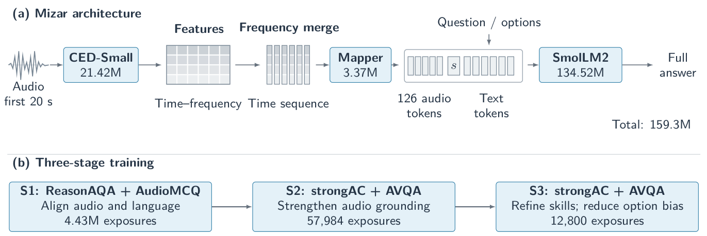

# Mizar: A 159M-Parameter Audio-Language Model for Audio Understanding

Mizar is a compact audio-language model that answers questions about sounds. It connects CED-Small to SmolLM2-135M through an audio–language mapper, with 159.3M parameters in total.

This repository accompanies our paper and includes inference code, the three-stage training pipeline, and data preparation tools.

**[Model](https://huggingface.co/KaiyangLi/Mizar-159M)** · **[Training data](https://huggingface.co/KaiyangLi/Mizar-159M/tree/main/data/manifests)** · **[Data guide](docs/DATA.md)** · **[Training details](docs/TRAINING.md)** · **[Evaluation](docs/EVALUATION.md)**



## Setup

```bash
git clone https://github.com/KaiyangLi1992/Mizar_159M.git
cd Mizar_159M
conda env create -f environment/train.yaml
conda activate mizar-train
python pipeline/download_assets.py
```

This downloads the final model, base assets, and tokenizer from Hugging Face. The training environment uses Python 3.10, PyTorch 2.5.1, CUDA 12.4, and Transformers 4.46.3. See [environment notes](docs/ENVIRONMENT.md) for details.

## Try Mizar

Save your audio path and question in `my_input.json`:

```json
[
  {
    "id": "my-recording",
    "audio": "/absolute/path/to/recording.wav",
    "question": "What can be heard in this recording?"
  }
]
```

Prepare the audio, then generate an answer with vLLM:

```bash
conda activate mizar-train
python pipeline/prepare_inference.py \
  --checkpoint checkpoints/final/stage3_q4_seed20260905.ckpt \
  --input my_input.json --output inference/my_recording --device cpu

conda env create -f environment/vllm.yaml
conda activate mizar-vllm
python pipeline/generate_vllm.py \
  --bundle inference/my_recording \
  --output inference/my_recording/answers.json
```

Inference uses the first 20 seconds of audio and generates a full text answer. For multiple-choice questions, add a `choices` array containing the four answer texts. The checkpoint loads through the supplied code; vLLM generation requires a compatible GPU.

## Training

The three stages align audio and language, strengthen audio grounding, and refine the model on **strongAC + AVQA**.

First, download the training manifests and configure your local data paths:

```bash
conda activate mizar-train
python pipeline/download_assets.py --training-data
python pipeline/unpack_data.py
python pipeline/configure_local.py
```

Follow the [data guide](docs/DATA.md) to obtain the source audio, prepare feature caches, and edit `configs/assets.local.yaml`. The download includes complete training manifests; raw audio and feature caches are obtained separately.

### Stage 1: Audio–language alignment

```bash
python pipeline/validate_assets.py --assets configs/assets.local.yaml --stage s1
python pipeline/render_config.py s1 \
  --assets configs/assets.local.yaml --output resolved_configs/s1.yaml
python pipeline/launch_stage.py s1 \
  --config resolved_configs/s1.yaml --output runs/s1 --execute
```

Set `s1_checkpoint` in `configs/assets.local.yaml` to the resulting epoch-3 checkpoint before continuing.

### Stage 2: Audio-dependent fine-tuning

```bash
python pipeline/validate_assets.py --assets configs/assets.local.yaml --stage s2
python pipeline/render_config.py s2 \
  --assets configs/assets.local.yaml --output resolved_configs/s2.yaml
python pipeline/launch_stage.py s2 \
  --config resolved_configs/s2.yaml --output runs/s2 --execute
```

Set `s2_checkpoint` to the Stage-2 update-906 checkpoint before continuing.

### Stage 3: Q4 refinement

```bash
python pipeline/validate_assets.py --assets configs/assets.local.yaml --stage s3-q4
python pipeline/render_config.py s3-q4 --seed 20260905 \
  --assets configs/assets.local.yaml --output resolved_configs/s3.yaml
python pipeline/launch_stage.py s3-q4 \
  --config resolved_configs/s3.yaml --output runs/s3 --execute
```

See [training details](docs/TRAINING.md) for GPU requirements, checkpoint settings, and all five seeds, or [the Q4 recipe](docs/S3_Q4.md) for data selection and reconstruction. Hugging Face hosts one final model; intermediate checkpoints are produced by training.

## Evaluation

We use MMAU-mini for validation and evaluate on MMAU full9k, MMAR, and ADQA-clean. Answers are freely generated and scored with the official evaluators. The [evaluation guide](docs/EVALUATION.md) provides commands; [reproducibility notes](docs/TRAINING.md#evaluation-and-reproducibility-scope) document test exposure and known audio overlaps.

## License

See [LICENSE](LICENSE) and [NOTICE](NOTICE). Pretrained assets and datasets retain their upstream licenses.
